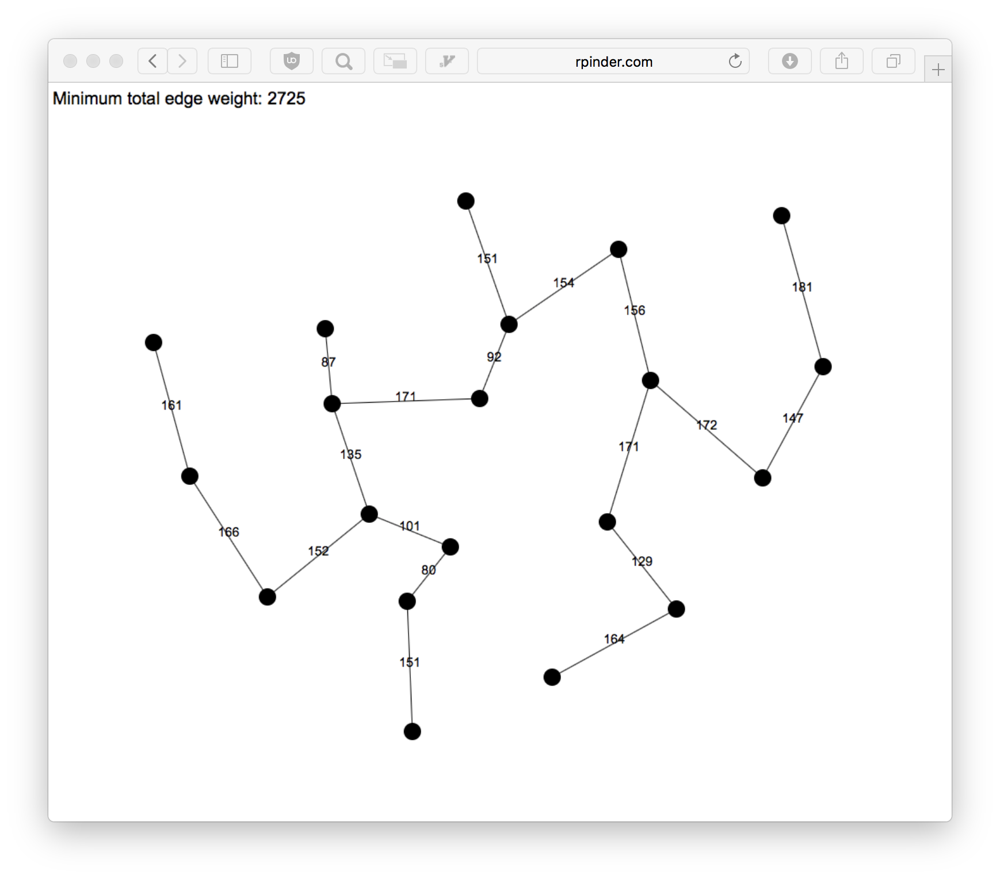

# Minimum-Connector-Problem
A website which calculates the minimum total edge weight of a network assuming all nodes have a non-infinite distance edge to all other nodes.

Left click to create a node and then left click on a node to destory it.

